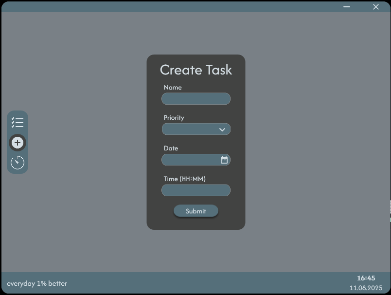
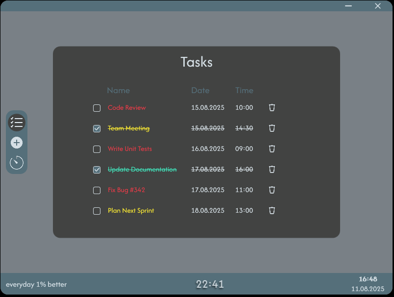
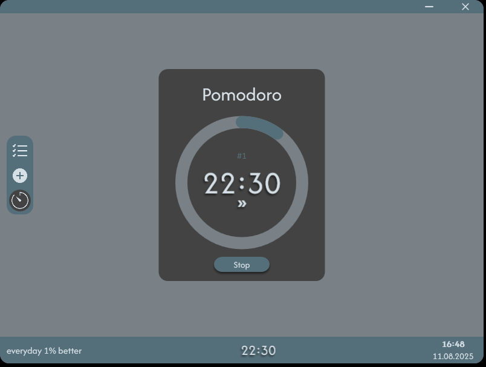

# TaskFlow
TaskFlow is a To-Do list application developed with **C#** and **WPF**, featuring an integrated Pomodoro timer to enhance productivity.

## Key Features
**Task Management:** Users can create tasks and assign priority, date, time, and name to each task.

**Pomodoro Timer:** Supports focused work sessions using the Pomodoro technique.

**MVVM Architecture:** The project follows the Model-View-ViewModel pattern for better maintainability and testability.

**SQLite Database:** All tasks are stored locally in a SQLite database for persistence and fast access.

## Screenshots

